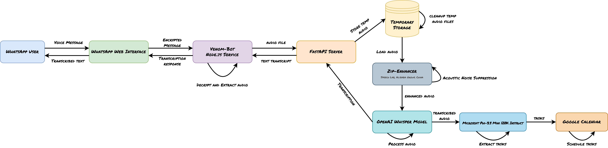

# WhatsWhisper
In today’s fast-paced world, voice messages offer a quick and convenient way to communicate when typing isn’t practical. However, they often fall short in noisy or public environments and can be challenging for those with hearing impairments. WhatsWhisper transforms your WhatsApp voice messages into versatile, actionable content by leveraging OpenAI's Whisper for precise transcription and Alibaba's ZipEnhancer for superior audio quality. Beyond simple transcription, it empowers you to schedule tasks effortlessly with Google Calendar integration and intelligently parse complex instructions using Microsoft's Phi-3.5.Experience a smarter, more accessible way to communicate and stay organized, wherever you are.

📝 Read the detailed blog post about WhatsWhisper on [Medium](https://saadsohail5104.medium.com/from-messy-audio-to-smart-tasks-how-whatswhisper-revolutionizes-whatsapp-voice-notes-a7461bfcfa7c)

## Features

- Voice message transcription using OpenAI's Whisper
- Acoustic Noise Suppression & Audio Quality Enhancement using the SOTA Speech Enhancement Model "ZipEnhancer" by Speech Lab, Alibaba Group, China
- Voice-powered task scheduling with Google Calendar integration
- Smart task parsing using Microsoft's Phi-3.5

## System Architecture

<div align="center">
  
</div>

The diagram above illustrates the flow of data in WhatsWhisper:
1. User sends a voice message via WhatsApp
2. Message is received by WhatsApp Web API via venom-bot
3. Audio file is passed through ZipEnhancer for quality improvement (optional)
4. Enhanced audio is processed by Whisper ASR for transcription
5. If scheduling command detected, text is analyzed by Phi-3.5 for task extraction
6. Extracted task details are used to create Google Calendar events
7. Final response (transcription/confirmation) is sent back to the user

## Prerequisites

- Python 3.8+
- Node.js 14+
- npm
- FFmpeg
- Google Calendar API credentials
- Groq API key (for OpenAI's Whisper)
- OpenRouter API key (for Phi-3.5)

## Installation

1. Clone the repository:
   ```bash
   git clone https://github.com/saadsohail05/WhatsWhisper.git
   cd WhatsWhisper
   ```

2. Set up your credentials:
   - Place `credentials.json` (Google Calendar API) in the root directory
   - Create `.env` file with:
     ```
     GROQ_API_KEY=your_groq_api_key
     OPENROUTER_API_KEY=your_openrouter_api_key
     ```

3. Run the setup script:
   ```bash
   python setup.py
   ```

4. Start the FastAPI server:
   ```bash
   python server.py
   ```

5. In a new terminal, start the WhatsApp bot:
   ```bash
   node whatsapp-bot.js
   ```

5. Scan the QR code that appears in the terminal with your WhatsApp to connect.

## Reset WhatsApp Session

To reset the WhatsApp session, you have two options:

1. Using the reset flag (recommended):
   ```bash
   node whatsapp-bot.js --reset
   ```

2. Manual reset:
   ```bash
   rm -rf tokens/
   node whatsapp-bot.js
   ```

After resetting, a new QR code will appear in the terminal. Scan it with WhatsApp to establish a new session.

##  Usage

The bot supports the following commands:

1. **Simple Transcription**
   - Send `!transcribe`
   - Send a voice message
   - Receive the transcribed text

2. **Enhanced Audio Transcription**
   - Send `!transcribe -e`
   - Send a voice message
   - Receive enhanced audio transcription

3. **Audio Enhancement**
   - Send `!enhance`
   - Send a voice message
   - Receive enhanced audio file

4. **Task Scheduling**
   - Send `!schedule`
   - Send a voice message like "Schedule a team meeting tomorrow at 2 PM for one hour"
   - Receive confirmation of scheduled task in Google Calendar

5. **Help**
   - Send `!commands` or `!help` to see available commands

##  Troubleshooting

- Verify all API keys are correctly set in `.env`
- Ensure Google Calendar credentials are properly configured
- Check server logs for detailed error messages
- Verify required directories (uploads, tokens, models) exist
- If the bot is not responding, make sure both FastAPI server and WhatsApp bot are running
- Ensure you have scanned the QR code to connect the bot to WhatsApp

##  Acknowledgments

- [venom-bot](https://github.com/orkestral/venom) - For WhatsApp Web automation
- [Groq](https://groq.com/) - For the Whisper API integration
- [OpenAI](https://openai.com/research/whisper) - For the Whisper speech recognition model
- [ZipEnhancer](https://zipenhancer.github.io/ZipEnhancer/) - For audio enhancement
- [Microsoft](https://www.microsoft.com/) - For the Phi-3.5 model
- [Google Calendar API](https://developers.google.com/calendar) - For scheduling integration

##  License

This project is licensed under the MIT License. See the [LICENSE](LICENSE) file for details.
